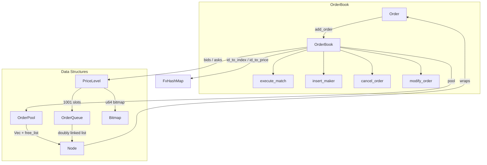

# Architecture

## System Overview



### Module Map

```
src/
├── price.rs          # Price(u64) newtype
├── order.rs          # Order, OrderSide, OrderType
├── order_pool.rs     # Node, OrderPool (Vec + free-list allocator)
├── order_queue.rs    # OrderQueue (intrusive doubly-linked list)
├── price_level.rs    # PriceLevel (1001 queues + bitmap + totals)
└── order_book.rs     # OrderBook (top-level matching engine)
```

---

## Data Structures

### Price (`price.rs`)

A simple newtype wrapper: `Price(pub u64)`.

Price maps to an array index via a fixed offset:
```
index = price.0 - PRICE_OFFSET (10000)
price = index + PRICE_OFFSET
```
Valid price range: `10000..=10000+MAX_LEVEL-1` → indices `0..1000`.

### Order (`order.rs`)

```rust
struct Order {
    id: u64,
    user_id: u64,       // for self-trade prevention
    asset_id: u64,
    quantity: u64,
    price: Price,
    side: OrderSide,     // Buy | Sell
    type: OrderType,     // GTC | IOC | FOK
    timestamp: u64,
}
```

### OrderPool (`order_pool.rs`)

A contiguous `Vec<Node>` backed memory pool with a `Vec<usize>` free-list.

```
┌──────┬──────┬──────┬──────┬──────┬──────┐
│Node 0│Node 1│Node 2│Node 3│Node 4│ ...  │  ← Vec<Node> (contiguous memory)
└──────┴──────┴──────┴──────┴──────┴──────┘
                 ▲
                 │
free_list: [2, 5, 8]   ← recycled indices, O(1) pop
```

- **allocate()**: Pops from free-list (O(1)), or pushes to end of Vec if empty
- **deallocate()**: Returns index to free-list (O(1)), no memory is freed

### Node (`order_pool.rs`)

```rust
struct Node {
    order: Order,
    next: Option<usize>,   // index into pool.nodes
    prev: Option<usize>,   // index into pool.nodes
}
```

The `next/prev` pointers form an **intrusive doubly-linked list** — the links live inside the node itself, not in a separate list structure.

### OrderQueue (`order_queue.rs`)

A doubly-linked list tracking `head` and `tail` indices into `OrderPool`.

```
head ──→ [Node A] ⇄ [Node B] ⇄ [Node C] ←── tail
```

Each price level has one `OrderQueue`. Orders at the same price are served FIFO (price-time priority).

- **push_back()**: Appends to tail, O(1)
- **unlink()**: Removes any node by index, O(1) — no traversal needed

### PriceLevel (`price_level.rs`)

Manages 1001 price levels using three parallel arrays:

```
Index:    [  0  ][  1  ][  2  ] ... [ 1000 ]
levels:   [Queue][Queue][Queue] ... [Queue ]   ← OrderQueue per price
totals:   [ 500 ][ 0   ][ 200 ] ... [  0   ]   ← total qty at each level
bitmap:   [1 0 1 0 0 0 0 0 | 0 0 1 ...]        ← 16 × u64 chunks
```

#### Bitmap

The bitmap is `[u64; 16]` where each bit represents whether a price level has orders.

- **find_next_non_empty_from(start)**: Uses `trailing_zeros()` to find the lowest ask → O(1) amortized
- **find_prev_non_empty_from(start)**: Uses `leading_zeros()` to find the highest bid → O(1) amortized
- **set_bit / clear_bit**: Toggled when `totals[i]` transitions to/from zero

These compile down to single CPU instructions (`TZCNT`, `LZCNT`) with `target-cpu=native`.

### OrderBook (`order_book.rs`)

```rust
struct OrderBook {
    pool: OrderPool,                    // shared node storage
    bids: PriceLevel,                   // buy side
    asks: PriceLevel,                   // sell side
    id_to_index: FxHashMap<u64, usize>, // order_id → node index
    id_to_price: FxHashMap<u64, Price>, // order_id → price
    best_ask_index: Option<usize>,      // cached best ask level
    best_bid_index: Option<usize>,      // cached best bid level
}
```

---

## Operations

### add_order

```
match order.type:

  GTC / IOC:
    remaining = match_order(order)     ← sweep opposite side
    if remaining > 0 AND type == GTC:
      insert_maker(order)              ← rest on book
    // IOC: discard remainder silently

  FOK:
    available = check_available(order) ← read-only scan
    if available >= order.quantity:
      match_order(order)               ← guaranteed full fill
    // else: reject entirely, book untouched
```

### execute_match (inner matching loop)

```
while there is a valid price level on the opposite side:
    if taker price doesn't cross level price → break

    walk the OrderQueue at this level (FIFO):
        skip if same user_id (self-trade prevention)
        trade_qty = min(remaining, resting_qty)
        reduce resting order quantity
        if resting order fully filled → unlink + deallocate + remove from maps

    if level is fully consumed → advance to next level via bitmap
    else → break (partial fill at this level)
```

### cancel_order

```
1. O(1) lookup: id_to_index[order_id] → node_index
2. Read node: side, quantity, price
3. Compute price_idx from price
4. Unlink node from OrderQueue at levels[price_idx]
5. Subtract quantity from totals (updates bitmap if zero)
6. If this was the best bid/ask → recalculate via bitmap scan
7. Deallocate node back to pool free-list
8. Remove from id_to_index and id_to_price maps
```

### modify_order

Cancel-and-replace strategy — the order loses time priority:

```
1. Snapshot order data from the existing node
2. cancel_order(order_id)
3. insert_maker(new_order) with updated price/quantity
```

---

## Performance Design

| Technique | Impact | Where |
|---|---|---|
| **u64 bitmap + TZCNT/LZCNT** | O(1) best-price discovery | `price_level.rs` |
| **Vec + free-list pool** | Zero heap allocation during trading | `order_pool.rs` |
| **Intrusive linked list** | O(1) insert/remove, cache-friendly | `order_queue.rs` |
| **FxHashMap** | Fast O(1) order lookup by ID | `order_book.rs` |
| **`unsafe get_unchecked`** | Eliminates bounds checks in hot loop | `execute_match` |
| **`target-cpu=native`** | Hardware POPCNT/LZCNT/TZCNT | `.cargo/config.toml` |
| **LTO fat + codegen-units=1** | Maximum cross-crate inlining | `Cargo.toml` |

---

## Limitations

- **Single asset**: One `OrderBook` instance, no `Exchange` multi-book wrapper
- **Fixed price range**: 1001 levels from `PRICE_OFFSET` to `PRICE_OFFSET + 1000`
- **No trade reports**: `execute_match` doesn't emit `Trade` events
- **No network layer**: No TCP/UDP/WebSocket gateway
- **No persistence**: All state is in-memory, lost on crash
- **No risk management**: No position limits, price bands, or circuit breakers
