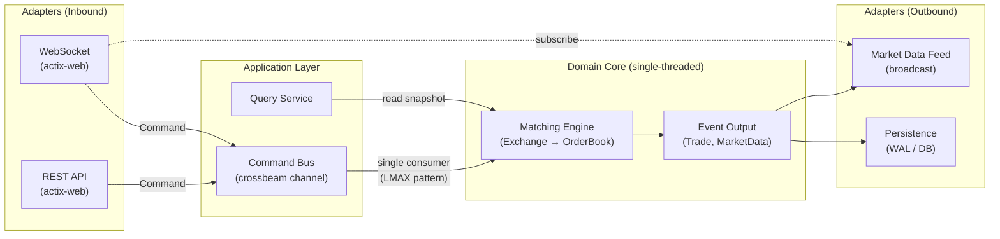

# Architecture

## High-Level Design: Hybrid Hexagonal + LMAX



### Design Principles

**Hexagonal (Ports & Adapters)**
- The domain core (`OrderBook`, `Exchange`) has **zero dependencies** on web frameworks, serialization, or I/O
- Inbound ports: traits/channels that accept commands
- Outbound ports: event buffers that adapters consume
- Adapters are swappable — REST today, FIX protocol tomorrow

**LMAX Disruptor Pattern**
- All commands flow through a **single channel** into the matching engine thread
- The engine processes commands **sequentially on one thread** — no locks, no contention
- Events (trades, market data) are published to subscribers after each command

---

## Cargo Workspace

The project uses a **Cargo workspace** to enforce layer boundaries at compile time. Each layer is a separate crate with its own `Cargo.toml`, making it impossible for the domain to accidentally depend on a web framework.

```
trading/
├── Cargo.toml                          # [workspace] root
├── docs/
│   └── architecture.md
│
├── crates/
│   ├── domain/                         # Pure business logic
│   │   ├── Cargo.toml                  # deps: rustc-hash
│   │   └── src/
│   │       ├── lib.rs
│   │       ├── order.rs                # Order, OrderSide, OrderType
│   │       ├── trade.rs                # Trade execution report
│   │       ├── price.rs                # Price(u64) newtype
│   │       ├── error.rs                # OrderError enum
│   │       ├── market_data.rs          # MarketDataEvent enum
│   │       ├── order_book.rs           # Single-asset matching engine
│   │       ├── exchange.rs             # Multi-asset router
│   │       ├── order_pool.rs           # Vec + free-list allocator
│   │       ├── order_queue.rs          # Intrusive doubly-linked list
│   │       └── price_level.rs          # Bitmap + totals + queues
│   │
│   ├── application/                    # Command/query orchestration
│   │   ├── Cargo.toml                  # deps: domain, crossbeam-channel, tokio
│   │   └── src/
│   │       ├── lib.rs
│   │       ├── command.rs              # Command enum
│   │       ├── response.rs             # Response enum
│   │       └── engine_thread.rs        # LMAX single-threaded consumer
│   │
│   └── adapters/                       # External I/O
│       ├── Cargo.toml                  # deps: application, domain, actix-web, serde
│       └── src/
│           ├── lib.rs
│           ├── rest/
│           │   ├── mod.rs
│           │   └── handlers.rs         # POST /orders, DELETE /orders/{id}
│           └── ws/
│               ├── mod.rs
│               └── market_feed.rs      # WebSocket market data broadcast
│
├── src/
│   └── main.rs                         # Binary: start engine thread + actix server
│
└── benches/
    └── orderbook_bench.rs              # Benchmarks (depends on domain)
```

---

## Layer Responsibilities

### Domain (`crates/domain`)

Pure Rust. **No framework dependencies.** Only `rustc-hash`.

| Module | Responsibility |
|---|---|
| `order.rs` | Order, OrderSide, OrderType |
| `trade.rs` | Trade execution report |
| `price.rs` | Price newtype |
| `error.rs` | OrderError enum |
| `market_data.rs` | MarketDataEvent enum |
| `order_book.rs` | Single-asset matching: add, cancel, modify |
| `exchange.rs` | Multi-asset routing: asset_id → OrderBook |
| `order_pool.rs` | Zero-alloc memory pool (Vec + free-list) |
| `order_queue.rs` | Intrusive doubly-linked list per price |
| `price_level.rs` | Bitmap + totals for O(1) best-price |

### Application (`crates/application`)

Bridges adapters ↔ domain. Owns the engine thread.

```rust
// command.rs
pub enum Command {
    AddOrder(Order),
    CancelOrder { asset_id: u64, order_id: u64 },
    ModifyOrder { asset_id: u64, order_id: u64, new_price: Price, new_qty: u64 },
}

// response.rs
pub enum Response {
    Trades(Vec<TradeResult>),
    Ack,
    Error(OrderError),
}
```

```rust
// engine_thread.rs — the LMAX consumer
fn run_engine(rx: Receiver<(Command, oneshot::Sender<Response>)>) {
    let mut exchange = Exchange::new(1_000_000);

    while let Ok((cmd, reply)) = rx.recv() {
        let response = match cmd {
            Command::AddOrder(order) => { /* exchange.add_order() */ },
            Command::CancelOrder { .. } => { /* exchange.cancel_order() */ },
            Command::ModifyOrder { .. } => { /* exchange.modify_order() */ },
        };
        let _ = reply.send(response);
    }
}
```

### Adapters (`crates/adapters`)

Depends on `actix-web` and `serde`. Translates HTTP/WebSocket ↔ Commands.

```rust
// rest/handlers.rs
async fn add_order(
    body: web::Json<AddOrderRequest>,
    engine: web::Data<EngineSender>,
) -> impl Responder {
    let (tx, rx) = oneshot::channel();
    engine.send((Command::AddOrder(order), tx)).unwrap();
    let response = rx.await.unwrap();
    HttpResponse::Ok().json(response)
}
```

---

## Data Flow

### Write Path (Order Submission)

```
1. Client ──POST /orders──→ actix-web handler        (adapters)
2. Deserialize JSON → Command::AddOrder               (adapters)
3. Send Command into crossbeam channel                 (application)
4. Engine thread receives, calls exchange.add_order()  (domain)
5. Response sent back via oneshot channel               (application)
6. Serialize → HTTP 200 JSON                           (adapters)
```

### Read Path (Market Data)

```
1. Engine processes command → MarketDataEvents          (domain)
2. Engine publishes to broadcast channel                (application)
3. WebSocket adapter receives events                    (adapters)
4. Serialize → push to all connected WS clients         (adapters)
```

---

## Data Structures

### OrderPool

```
┌──────┬──────┬──────┬──────┬──────┐
│Node 0│Node 1│Node 2│Node 3│ ...  │  ← Vec<Node> (contiguous)
└──────┴──────┴──────┴──────┴──────┘
free_list: [2, 5, 8]   ← O(1) pop
```

### PriceLevel

```
Index:    [  0  ][  1  ][  2  ] ... [ 1000 ]
levels:   [Queue][Queue][Queue] ... [Queue ]
totals:   [ 500 ][ 0   ][ 200 ] ... [  0   ]
bitmap:   [1 0 1 0 0 ...] ← 16 × u64, uses TZCNT/LZCNT
```

---

## Performance Design

| Technique | Impact | Where |
|---|---|---|
| **Single-threaded engine** | No locks, deterministic ordering | `engine_thread.rs` |
| **crossbeam channel** | Lock-free MPSC, ~30ns send/recv | Application layer |
| **u64 bitmap** | O(1) best-price discovery | `price_level.rs` |
| **Vec + free-list** | Zero heap allocation during trading | `order_pool.rs` |
| **Intrusive linked list** | O(1) insert/remove | `order_queue.rs` |
| **`unsafe get_unchecked`** | No bounds checks in hot loop | `execute_match` |
| **`target-cpu=native`** | Hardware TZCNT/LZCNT | `.cargo/config.toml` |
| **LTO fat + codegen-units=1** | Max cross-crate inlining | `Cargo.toml` |

