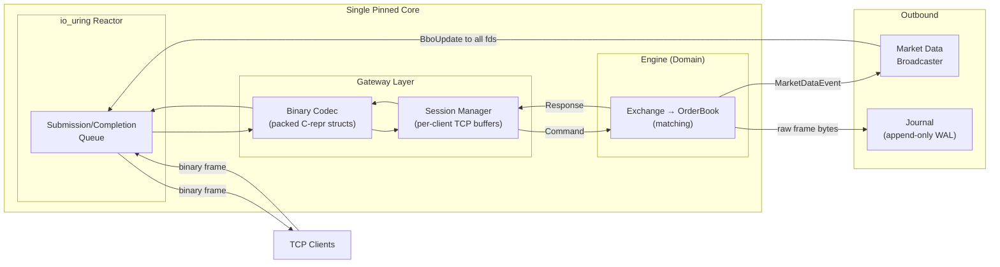
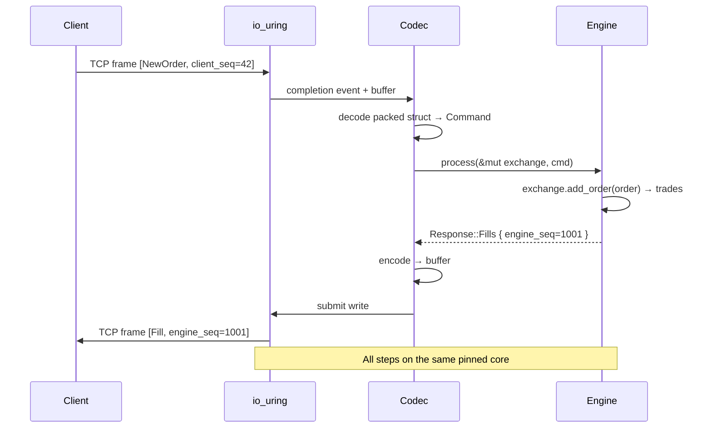
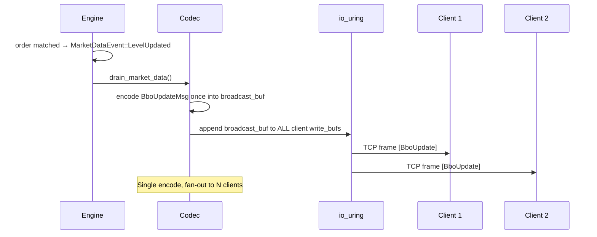
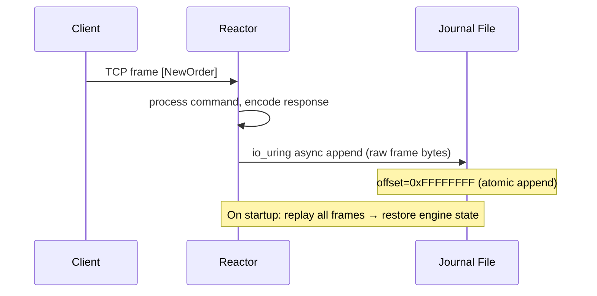

# Architecture

## 1. System Overview

A high-performance, low-latency matching engine for limit order books.

The system uses a **thread-per-core** architecture built on **`io_uring`**: network I/O and order matching run on the same pinned CPU core, eliminating inter-thread communication entirely. The domain logic follows **hexagonal (ports & adapters)** principles — the matching engine has zero dependencies on I/O, serialization, or networking.

### Why This Combination Works

The original design used a hybrid **Hexagonal + LMAX** pattern: a multi-threaded gateway forwarding commands over a crossbeam channel to a single-threaded engine consumer. This works, but the channel hop costs ~30ns and forces a context switch.

With `io_uring` and thread-per-core, the architecture **simplifies**:

| Aspect | LMAX (crossbeam channel) | Thread-per-core (io_uring) |
|---|---|---|
| Gateway ↔ Engine | crossbeam channel (~30ns hop) | Direct function call (~0ns) |
| Network I/O | tokio epoll (syscall per I/O op) | io_uring (batched, async syscalls) |
| Thread model | Gateway threads + 1 engine thread | 1 pinned core does everything |
| Cache behavior | Cross-core cache invalidation | All hot data in L1/L2 of one core |
| Determinism | Deterministic within engine thread | Deterministic within the entire loop |

The matching engine processes an order in ~30ns. The network round-trip dominates at ~3–10µs. Putting both on the same thread means:

```
io_uring completion (~1–2µs)
  → decode packed C struct (~50ns)
    → exchange.add_order() (~30ns)
  → encode packed C struct (~50ns)
→ io_uring submit (~1–2µs)

Total: ~3–5µs wire-to-wire
```

The matching engine never blocks the network loop because it's 50x faster than the I/O.

### Hexagonal Boundaries Survive

The hexagonal pattern doesn't require separate threads — it requires **dependency inversion**. The domain crate still has zero knowledge of `io_uring`, TCP, or packed structs. The boundary is enforced at compile time by Cargo workspace crate dependencies:

```
gateway → application → domain
  ✓           ✓           ✗ (no I/O deps)
```

The "port" is no longer a channel — it's a trait or a direct function call. The adapter is no longer a thread — it's a codec layer. The principle holds; only the mechanism changes.

---

## 2. Architecture Diagram



---

## 3. Wire Protocol

### Framing

All messages use length-prefixed binary frames over persistent TCP connections:

```
┌──────────┬──────────┬──────────────────────────────┐
│ len (4B) │ type (1B)│ packed C-repr payload (N B)  │
└──────────┴──────────┴──────────────────────────────┘
```

- **len**: `u32` little-endian — total frame size excluding the length field itself
- **type**: message type discriminant
- **payload**: `#[repr(C, packed)]` struct — zero-copy, no serialization overhead

### Message Types

| Direction | Type | Tag | Description |
|---|---|---|---|
| Client → Engine | `NewOrder` | `0x01` | Place a new limit order (GTC, IOC, FOK) |
| Client → Engine | `CancelOrder` | `0x02` | Cancel an existing order by ID |
| Client → Engine | `ModifyOrder` | `0x03` | Modify price and/or quantity |
| Engine → Client | `Ack` | `0x10` | Order accepted, engine seq assigned |
| Engine → Client | `Fill` | `0x11` | Trade execution report |
| Engine → Client | `Reject` | `0x12` | Order rejected with reason code |
| Engine → All | `BboUpdate` | `0x13` | Price level updated (broadcast to all clients) |

### Sequencing

- **Client seq** (`client_seq: u64`): monotonically increasing per session; set by the client
- **Engine seq** (`engine_seq: u64`): globally monotonic; assigned by the engine to every processed command

---

## 4. Layer Responsibilities

### Domain (`crates/domain`)

Pure Rust. **Zero I/O dependencies.** Only `rustc-hash` for the hash map.

| Module | Responsibility |
|---|---|
| `order_book.rs` | Single-asset matching: add, cancel, modify. Returns `&[Trade]`. |
| `exchange.rs` | Multi-asset router (`asset_id → OrderBook`). Exposes `drain_market_data()`. |
| `order_pool.rs` | Zero-alloc memory pool — `Vec<Node>` + free-list index stack |
| `order_queue.rs` | Intrusive doubly-linked list per price level |
| `price_level.rs` | `[u64; 16]` bitmap + totals array. O(1) best-price via hardware TZCNT/LZCNT. |
| `market_data.rs` | `MarketDataEvent` enum — emitted by the order book after state changes |

> **Rule**: No `serde`, no `std::io`, no `tokio`, no `async`. If a dependency does I/O, it does not belong here.

### Application (`crates/application`)

Command/response types and the engine entry point.

```rust
pub fn process(exchange: &mut Exchange, seq: &mut u64, cmd: Command) -> Response {
    *seq += 1;
    match cmd {
        Command::AddOrder { client_seq, order } => {
            match exchange.add_order(order) {
                Ok(trades) => Response::Fills { engine_seq: *seq, trades: trades.to_vec() },
                Err(e) => Response::Reject { engine_seq: *seq, client_seq, reason: e },
            }
        }
        // CancelOrder → Ack / Reject
        // ModifyOrder → Ack / Reject
    }
}
```

### Gateway (`crates/gateway`)

Owns io_uring reactor, TCP session management, and binary codec. This is the **only** crate that knows about networking.

| Module | Responsibility |
|---|---|
| `reactor.rs` | io_uring event loop — accept, read, write, journal append, signal handling |
| `session.rs` | Per-client state: read buffer, position tracking |
| `codec.rs` | Encode/decode — translates wire bytes ↔ `Command`/`Response` |
| `protocol.rs` | `#[repr(C, packed)]` message struct definitions |
| `journal.rs` | Write-ahead log — append raw frames, replay on startup |

---

## 5. Data Flow

### Write Path (New Order)



### Market Data Broadcast (Fan-Out)



### Journal / WAL Path



---

## 6. Core Data Structures

### OrderPool (zero-alloc arena)

```
┌──────┬──────┬──────┬──────┬──────┐
│Node 0│Node 1│Node 2│Node 3│ ...  │  ← Vec<Node> (contiguous, pre-allocated)
└──────┴──────┴──────┴──────┴──────┘
free_list: [2, 5, 8]   ← O(1) alloc via pop, O(1) dealloc via push
```

- Pre-allocates capacity at startup — zero heap allocation during trading
- Node stores order data + intrusive linked-list pointers (prev/next indices)

### PriceLevel (bitmap-indexed price array)

```
Index:    [  0  ][  1  ][  2  ] ... [ 999 ]
levels:   [Queue][Queue][Queue] ... [Queue]
totals:   [ 500 ][ 0   ][ 200 ] ... [  0  ]
bitmap:   [1 0 1 0 0 ...] ← 16 × u64, hardware TZCNT for best bid, LZCNT for best ask
```

- Bitmap gives O(1) best-price discovery — a single `TZCNT` instruction
- Each queue is an intrusive doubly-linked list → O(1) insert and cancel
